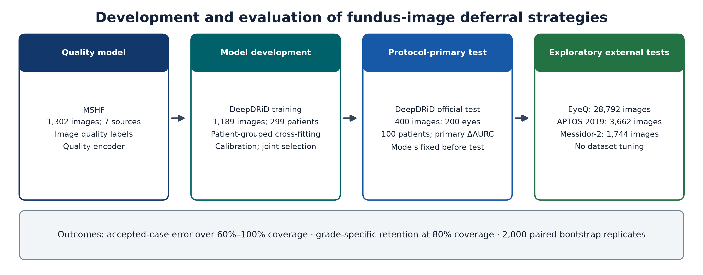

# Image-Quality Deferral and Retention of Proliferative Diabetic Retinopathy

This repository contains the code and aggregate results for the manuscript:

**Image-Quality Deferral and Retention of Proliferative Diabetic Retinopathy: A Retrospective Evaluation**

The study evaluates image-quality-aware deferral strategies for diabetic retinopathy screening. The protocol-primary analysis tests whether adding image-quality information to calibrated model confidence improves selective prediction on the DeepDRiD official test set. Exploratory external analyses examine grade-specific retention patterns across EyeQ, APTOS 2019, and Messidor-2.



## Repository Contents

| Path | Description |
| --- | --- |
| [`code/`](code/) | Training, inference, gate selection, frozen evaluation, severity retention, and cross-dataset synthesis scripts |
| [`configs/study_config.yaml`](configs/study_config.yaml) | Dataset and analysis configuration template |
| [`results/bootstrap/`](results/bootstrap/) | Aggregate bootstrap summaries and replicate-level aggregate outputs used for the released synthesis |
| [`tables/`](tables/) | Aggregate manuscript and supplementary tables |
| [`examples/smoke_metrics.py`](examples/smoke_metrics.py) | Synthetic-data smoke test for the selective prediction metrics |
| [`docs/reproducibility.md`](docs/reproducibility.md) | Reproduction workflow, expected inputs, and analysis sequence |
| [`docs/data_sources.md`](docs/data_sources.md) | Dataset sources and label provenance |
| [`docs/code_map.md`](docs/code_map.md) | Mapping from manuscript analyses to released scripts |
| [`docs/public_release_boundary.md`](docs/public_release_boundary.md) | Items included and excluded from the public release |

## Quick Check

Install a compatible PyTorch and torchvision pair for your platform, then install the remaining dependencies:

```bash
python -m pip install -r requirements.txt
```

Run the synthetic metric smoke test:

```bash
python examples/smoke_metrics.py
```

Run the released aggregate synthesis:

```bash
python code/synthesize_cross_dataset_evidence.py \
  --input-dir results/bootstrap \
  --output-dir outputs/synthesis
```

The smoke test uses synthetic data. The synthesis command uses only aggregate bootstrap files included in this repository.

## Full Reproduction

Full image-level reproduction requires local copies of the source datasets and trained model checkpoints. After obtaining the datasets from their original providers, update [`configs/study_config.yaml`](configs/study_config.yaml) with local paths and follow [`docs/reproducibility.md`](docs/reproducibility.md).

The released scripts cover the main analysis stages:

1. quality-model preparation and training;
2. DeepDRiD model development and official frozen evaluation;
3. confidence-only, quality-only, and combined gate selection;
4. severity-specific retention analysis at fixed coverage;
5. exploratory external evaluation on EyeQ, APTOS 2019, and Messidor-2;
6. cross-dataset aggregate synthesis from bootstrap outputs.

## Released Results

The included aggregate outputs support the manuscript tables and the released synthesis workflow. The primary DeepDRiD evaluation did not show a conclusive reduction in selective error from adding image-quality information to calibrated confidence. The external dataset analyses are retrospective and exploratory.

## Data Availability

Raw fundus images, patient-level manifests, image-level predictions, model checkpoints, credentials, and manuscript documents are not included in this public code release. The repository includes aggregate tables and bootstrap outputs intended to support reproducibility of the reported analyses without redistributing restricted data.

## Citation

Please cite the manuscript when using this repository. Bibliographic details will be added after publication.
